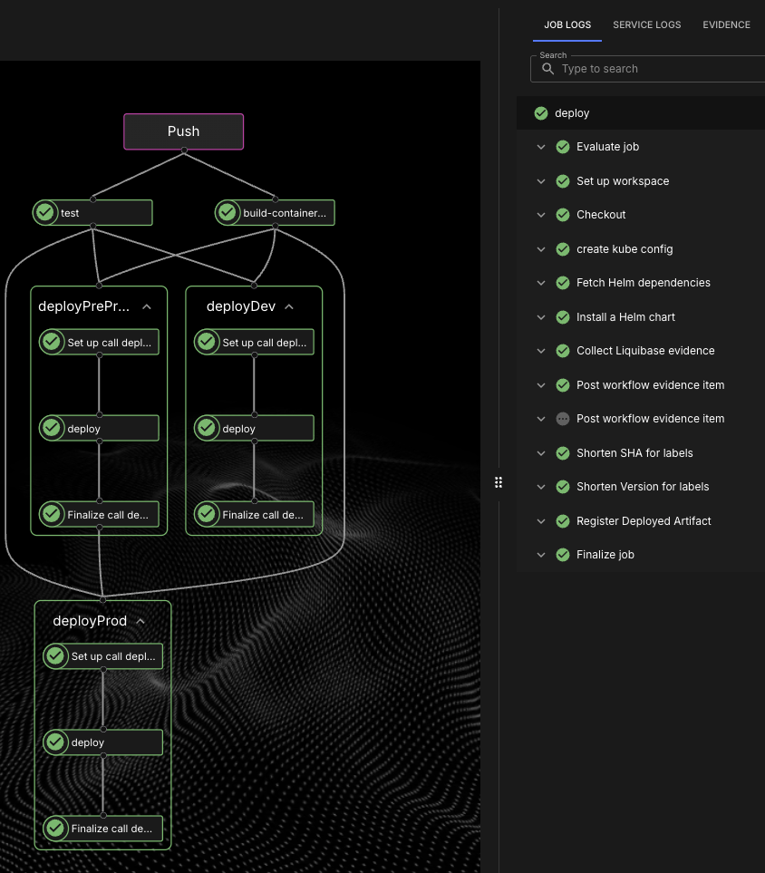
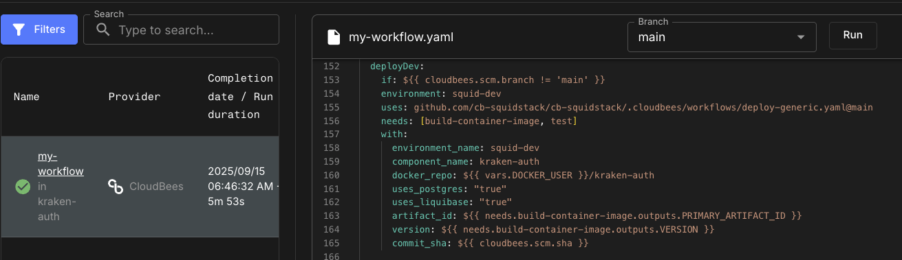
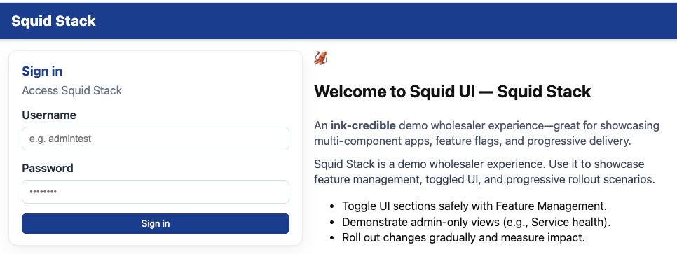
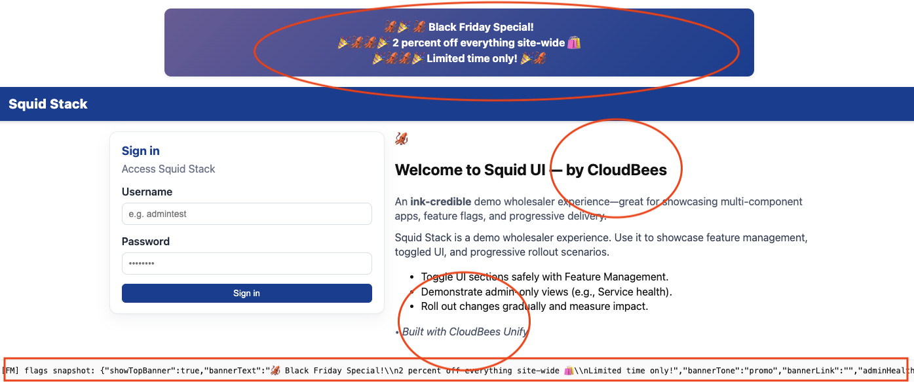

# SquidStack - AIB RFP Demo

**SquidStack** is a demo microservices application showcasing CloudBees CI/CD orchestration capabilities for the AIB RFP.

## Overview

This application demonstrates:
- **Multi-component CI/CD orchestration** - Database, Frontend, Backend services
- **CloudBees Unify as platform orchestrator** - Orchestrating component pipelines
- **Mix of CloudBees CI and Unify DSL** - Flexible pipeline approaches
- **Infrastructure as Code with governance** - Terraform + Checkov + OPA + Infracost
- **Environment inventory** - Version tracking across DEV/PREPROD/PROD
- **Third-party integrations** - Checkmarx/Polaris, Jira approvals
- **Centralized workflow management** - Shared templates, not per-repo duplication
- **Promotion workflows** - Branch-based with approval gates

👉 [Jump to AIB Requirements](#aib-demo-requirements)
👉 [Jump to Task Tracking](TASKS.md)
👉 [Jump to Discussion Log](DISCUSSION.md)

---

## Components Overview

### Core Services (4)

| Component | Tech Stack | Purpose | Database |
|-----------|------------|---------|----------|
| [squid-ui](https://github.com/squidstack/squid-ui) | React 18 + NGINX | Frontend & API Gateway | No |
| [kraken-auth](https://github.com/squidstack/kraken-auth) | Go + PostgreSQL | Authentication & User Management | Yes (`auth`) |
| [clam-catalog](https://github.com/squidstack/clam-catalog) | Go + PostgreSQL | Product Catalog & Stock | Yes (`catalog`) |
| [codlocker-assets](https://github.com/squidstack/codlocker-assets) | Go | Static Asset Server | No |

### Infrastructure & Testing (2)

| Component | Tech Stack | Purpose |
|-----------|------------|---------|
| [squidstack-terraform](https://github.com/squidstack/squidstack-terraform) | Terraform + Governance | Infrastructure as Code with Checkov, OPA, Infracost |
| [squidstack-e2e-tests](https://github.com/squidstack/squidstack-e2e-tests) | Playwright | End-to-end tests (42 tests) |

### Central Orchestration (1)

| Component | Purpose |
|-----------|---------|
| [squidstack](https://github.com/squidstack/squidstack) | Shared CloudBees workflow templates (build, test, deploy, release) |

**Total: 7 repositories**

---

## 💡 What We've Built So Far

### ✅ Fully Implemented Services

#### 1. **kraken-auth** - Authentication & User Management
- **JWT-based authentication** with HS256 signing
- **Role-based access control** (RBAC) with roles: user, admin, storeadmin, betauser, betaadmin
- **Complete user CRUD operations** (admin only):
  - Create users with username, password, profile, and roles
  - Update user profiles (name, email, phone, address, country)
  - Manage user roles (add/remove)
  - Reset user passwords
- **Database-driven country validation** (201 countries from PostgreSQL)
- **Liquibase migrations** with idempotent seed data
- **80+ comprehensive tests** covering all endpoints and business logic
- **Endpoints**: `/login`, `/admin/users`, `/admin/roles`, `/admin/countries`, health checks

#### 2. **clam-catalog** - Product Catalog & Stock Management
- **Product CRUD operations** with JWT authorization for admin
- **55 seeded products** across 5 categories (Electronics, Clothing, Home, Sports, Books)
- **Stock management** consolidated here (`stock_count` field) - no separate inventory service
- **Product fields**: name, description, price, images[], category, SKU, stock_count, tags[], rating, review_count
- **Public read endpoints** (no auth required) for browsing
- **Protected admin endpoints** for create/update/delete operations
- **Pagination and filtering** support
- **Liquibase migrations** with CSV seed data
- **55+ comprehensive tests**
- **Integration**: Product images served via codlocker-assets

**Architecture decision**: Stock management was consolidated into clam-catalog for simplicity. The originally planned `nautilus-inventory` service is not used.

#### 3. **codlocker-assets** - Static Asset Server
- **Serves product images** and static files
- **55 placeholder SVG images** bundled in container (organized by category)
- **Storage abstraction layer** (local filesystem, future: S3/GCS)
- **Content-Type detection** and caching headers
- **Path traversal protection**
- **50+ comprehensive tests**
- **Endpoints**: `/assets/*` (product images), health checks

#### 4. **squid-ui** - React Frontend & API Gateway
- **React 18 frontend** with CloudBees Feature Management (Rox) integration
- **API Gateway pattern**: nginx reverse proxy routes all `/api/*` requests to backend services
- **No direct backend access**: All services are internal-only, UI is sole external entry point
- **Authentication flow**: Login, JWT storage, auto-logout on token expiry
- **Admin features**:
  - **User Admin** (full CRUD): Create, edit, delete users; manage roles; reset passwords
  - **Service Health** dashboard (admin only, flag-gated)
  - Database-driven country dropdown (201 countries)
- **Product catalog browsing** with categories and filtering
- **Feature flag integration**: Dynamic UI control (banners, admin sections, company branding, etc.)
- **62+ comprehensive tests** (React components, API clients)
- **nginx configuration**: Runtime DNS resolution with Kubernetes service discovery

**Key architectural element**: squid-ui is the **only service with external ingress**. All backend calls flow through its nginx reverse proxy, eliminating CORS concerns.

### 🧪 Test Coverage

All implemented services include comprehensive test suites:
- **Infrastructure tests**: Logger, middleware, HTTP handlers, routing
- **Business logic tests**: Authentication, JWT, password hashing, CRUD operations
- **Integration tests**: End-to-end API tests with mocked dependencies
- **Code coverage**: 80-100% on most packages

Test results and coverage reports published to **CloudBees Unify** evidence for every workflow run.

---

## 🚀 What's Next: Implementation Roadmap

### 🔥 Priority 1: **barnacle-reviews** (Next Implementation)

Product review and rating service - **scheduled for implementation next**.

**Why implement this first:**
1. **Simple scope**: Straightforward CRUD operations with clear business logic
2. **Immediate value**: Product reviews significantly enhance the e-commerce experience
3. **No complex dependencies**: Only requires auth and catalog (both already implemented)
4. **Visual impact**: Users can immediately see and interact with reviews in the UI
5. **Patterns established**: Can reuse database/Liquibase patterns from kraken-auth

**Planned features:**
- User-submitted product reviews with 1-5 star ratings
- Review voting (helpful/not helpful)
- Moderation tools for admin users
- Aggregate rating updates to clam-catalog
- Review filtering and sorting

**Database**: PostgreSQL with `reviews` schema
**Tables**: `reviews`, `review_votes`, `review_flags`

---

### Priority 2: **cuttlefish-orders** (Second Implementation)

Order processing and lifecycle management.

**Planned features:**
- Order creation from shopping cart
- Order status tracking (pending, processing, shipped, delivered, cancelled)
- Order history for customers
- Admin order management
- Stock deduction in clam-catalog when orders placed
- Payment simulation (initially mocked, later integrated with octopus-payments)

**Dependencies**: kraken-auth (complete), clam-catalog (complete)
**Database**: PostgreSQL with `orders` schema
**Tables**: `orders`, `order_items`, `order_events`, `order_payments`

---

### Future Implementations (Supporting Services)

**After reviews and orders are operational**, these supporting services can be implemented:

- **octopus-payments**: Payment simulation/mocking (has 178 tests already)
- **jellyfish-notifications**: Email/SMS notifications for order status changes
- **manta-delivery**: Shipping tracking and delivery estimates
- **urchin-analytics**: User behavior tracking and engagement metrics
- **squid-recommendations**: Product recommendations based on behavior/purchases

---

### ❌ Not Planned for Implementation

- **nautilus-inventory**: Stock management consolidated into clam-catalog. This service will remain a stub unless complex multi-warehouse requirements emerge.

---

## 📐 Architecture

### 🌐 Key Architectural Pattern: API Gateway (Not Service Mesh)

**SquidStack uses an API Gateway pattern**, not a service mesh. All backend services are internal-only and accessed through the squid-ui nginx reverse proxy.

```
┌─────────────────────────────────────────────────────────────────┐
│                                                                 │
│  External Traffic (HTTPS)                                       │
│  └─> squid-ui Ingress (ONLY external-facing service)           │
│                                                                 │
└────────────────────────────────┬────────────────────────────────┘
                                 │
                                 ▼
┌─────────────────────────────────────────────────────────────────┐
│  squid-ui Pod                                                   │
│  ┌──────────────────────────────────────────────────────────┐  │
│  │  NGINX (API Gateway / Reverse Proxy)                     │  │
│  │  • Routes /api/kraken-auth/* → kraken-auth:8080          │  │
│  │  • Routes /api/clam-catalog/* → clam-catalog:8080        │  │
│  │  • Routes /assets/* → codlocker-assets:8080              │  │
│  │  • Serves React SPA from /usr/share/nginx/html           │  │
│  │  • Runtime DNS resolution (lazy lookup via variables)    │  │
│  └──────────────────────────────────────────────────────────┘  │
└─────────────────────────────────────────────────────────────────┘
                                 │
              ┌──────────────────┼──────────────────┐
              ▼                  ▼                  ▼
    ┌─────────────────┐ ┌─────────────────┐ ┌─────────────────┐
    │ kraken-auth     │ │ clam-catalog    │ │ codlocker-assets│
    │ (internal only) │ │ (internal only) │ │ (internal only) │
    │ Port: 8080      │ │ Port: 8080      │ │ Port: 8080      │
    │ No external     │ │ No external     │ │ No external     │
    │ ingress         │ │ ingress         │ │ ingress         │
    └─────────────────┘ └─────────────────┘ └─────────────────┘
```

**Key Points:**
- **Zero service-to-service HTTP calls**: Services do not call each other directly (yet)
- **All traffic flows through nginx**: Browser → nginx → backend service
- **No CORS issues**: Same-origin requests via nginx proxy
- **Kubernetes service discovery**: nginx uses DNS with runtime resolution
- **Future service calls**: When cuttlefish-orders needs clam-catalog, it will call it directly (not through nginx)

### 📊 Service Overview

```
FULLY IMPLEMENTED SERVICES
─────────────────────────────────────────────────────────────────

┌─────────────────────────────────────────────────────────────────┐
│  squid-ui (React + NGINX API Gateway)                          │
│  • External ingress: HTTPS on port 80/443                      │
│  • React 18 frontend with feature flags                        │
│  • Proxies all /api/* requests to backend services             │
│  • Admin UI: User CRUD, Service Health                         │
└─────────────────────────────────────────────────────────────────┘

┌─────────────────────────────────────────────────────────────────┐
│  kraken-auth (Auth + User Management)                          │
│  PostgreSQL Schemas: auth, public                              │
│  Tables:                                                       │
│   • users (id, username, timestamps)                           │
│   • auth_credentials (password hashes)                         │
│   • user_profiles (full_name, email, phone, address,          │
│                     country_code, roles[])                     │
│   • countries (201 countries: code, name, restricted, can_ship)│
│   • roles (user, admin, storeadmin, betauser, betaadmin)       │
│                                                                │
│  Features:                                                     │
│   • JWT issuance with HS256 signing                           │
│   • User CRUD (create, update profile, manage roles, reset pw)│
│   • Database-driven country dropdown                           │
└─────────────────────────────────────────────────────────────────┘

┌─────────────────────────────────────────────────────────────────┐
│  clam-catalog (Product Catalog + Stock)                        │
│  PostgreSQL Schema: catalog                                    │
│  Tables:                                                       │
│   • products (id, name, description, price, images[],         │
│               category, sku, stock_count, tags[], rating,     │
│               review_count, timestamps)                        │
│                                                                │
│  Features:                                                     │
│   • 55 seeded products (5 categories)                         │
│   • Public read endpoints (no auth)                           │
│   • Admin write endpoints (JWT required)                      │
│   • Stock management (replaces nautilus-inventory)            │
│   • Pagination and category filtering                         │
└─────────────────────────────────────────────────────────────────┘

┌─────────────────────────────────────────────────────────────────┐
│  codlocker-assets (Static Asset Server)                        │
│  • 55 SVG product images bundled in container                 │
│  • Storage abstraction (local, future: S3/GCS)                │
│  • Serves /assets/* with proper Content-Type                  │
└─────────────────────────────────────────────────────────────────┘


STUB SERVICES (Health checks only, no business logic)
─────────────────────────────────────────────────────────────────

🔥 barnacle-reviews (NEXT PRIORITY)
   • Product reviews and ratings
   • Planned DB: reviews schema

🥈 cuttlefish-orders (SECOND PRIORITY)
   • Order processing and lifecycle
   • Planned DB: orders schema

Future: octopus-payments, urchin-analytics, squid-recommendations,
        jellyfish-notifications, manta-delivery

❌ NOT USED: nautilus-inventory (stock consolidated into clam-catalog)
```

---

## 🔑 Key Design Principles & Architectural Decisions

### 1. API Gateway Pattern (Not Service Mesh)
- **squid-ui is the ONLY external-facing service** with ingress
- All backend services are internal-only (ClusterIP services)
- nginx in squid-ui proxies all `/api/*` requests to backend services
- Zero CORS configuration needed (same-origin requests via proxy)
- Kubernetes DNS with runtime resolution using nginx variables

### 2. Separation of Concerns
- Each service owns its domain (auth, catalog, reviews, orders)
- Services have clear, focused responsibilities
- No business logic duplication across services

### 3. Database Per Service
- Each service with a database owns its PostgreSQL schema
- kraken-auth: `auth` and `public` schemas
- clam-catalog: `catalog` schema
- Future: barnacle-reviews (`reviews`), cuttlefish-orders (`orders`)
- squid-ui is stateless (JWT + user snapshot in browser localStorage only)

### 4. JWT-Based Security (Shared Secret)
- All services share the same `JWT_SECRET` for token validation
- kraken-auth issues tokens, other services validate them
- Algorithm: HS256 (HMAC with SHA-256)
- Claims: `sub` (user ID), `name` (username), `roles[]`, `exp`, `iat`
- Token lifespan: 24 hours by default

### 5. Liquibase for Schema Management
- All database schemas managed via Liquibase migrations
- Idempotent changesets (safe to reapply)
- Seed data loaded from CSV files
- Migration runs automatically during deployment (Kubernetes Job)

### 6. Stock Management Consolidated
- **Architectural decision**: Stock management is in clam-catalog (`stock_count` field)
- Originally planned separate `nautilus-inventory` service NOT used
- Simplifies architecture by reducing service dependencies
- Future orders will update clam-catalog stock directly

### 7. Feature Management with CloudBees Unify
- Feature flags control UI visibility and behavior
- Flags: `adminUsers`, `adminHealth`, `showTopBannerEnhanced`, `logLevel`, etc.
- User context passed to flags (roles, country, email, etc.)
- Flag changes apply immediately without redeployment

### 8. Comprehensive Testing
- 80-100% code coverage on infrastructure and business logic
- Test types: Unit, integration, HTTP handler, middleware
- Results published to CloudBees Unify evidence on every run

### 9. Deployment Strategy
- **Branch-based environments**:
  - Non-main branches → `squid-dev`
  - Main branch → `squid-preprod` → `squid-prod` (with approval gates)
- Helm charts with shared reusable workflow templates
- Database migrations run automatically before service deployment
- Feature flags enable gradual rollout and A/B testing

---

## 🚀 CloudBees Unify Integration

SquidStack uses **CloudBees Unify** to drive consistent CI/CD workflows across services.  
This is one of the key goals of the project — to **showcase Unify in action**.

### 🔑 How we use Unify

- **Workflow templates**:  
  Shared templates used by `squid-ui` and `kraken-auth` (and future services).  
  Define standard jobs for build, test, deploy, and Liquibase rollout.

- **Actions**:  
  Standard CloudBees actions are called for container builds, Kubernetes deploys, and database migrations.

- **Secrets & Parameters**:  
  Workflows use secrets and params to conditionally enable steps (e.g., Liquibase rollout for DB services, skipped for frontend-only).

---

### 📜 Example — workflow calling a template
#### No database, same workflow

```# Reusable template call (same template, different params per environment)

jobs:
  # --- DEV: any non-main branch ---
  deployDev:
    if: ${{ cloudbees.scm.branch != 'main' }}
    environment: squid-dev
    uses: github.com/cb-squidstack/cb-squidstack/.cloudbees/workflows/deploy-generic.yaml@main
    needs: [build-container-image, test]
    with:
      component_name: squid-ui
      environment_name: squid-dev
      docker_repo: ${{ vars.DOCKER_USER }}/squid-ui
      artifact_id: ${{ needs.build-container-image.outputs.PRIMARY_ARTIFACT_ID }}
      version: ${{ needs.build-container-image.outputs.VERSION }}
      commit_sha: ${{ cloudbees.scm.sha }}
      hostname: squid-dev.guru-rep.sa-demo.beescloud.com
      feature_flags_enabled: "true"
    secrets:
      kubeconfig_secret: ${{ secrets.kubeconfig_squid_dev }}
      FM_KEY_SECRET: ${{ secrets.FM_KEY }}

  # --- PREPROD: main branch (gates prod) ---
  deployPreProd:
    if: ${{ cloudbees.scm.branch == 'main' }}
    environment: squid-preprod
    uses: github.com/cb-squidstack/cb-squidstack/.cloudbees/workflows/deploy-generic.yaml@main
    needs: [build-container-image, test]
    with:
      component_name: squid-ui
      environment_name: squid-preprod
      docker_repo: ${{ vars.DOCKER_USER }}/squid-ui
      artifact_id: ${{ needs.build-container-image.outputs.PRIMARY_ARTIFACT_ID }}
      version: ${{ needs.build-container-image.outputs.VERSION }}
      commit_sha: ${{ cloudbees.scm.sha }}
      hostname: squid-preprod.guru-rep.sa-demo.beescloud.com
      feature_flags_enabled: "true"
    secrets:
      kubeconfig_secret: ${{ secrets.kubeconfig_squid_dev }}
      FM_KEY_SECRET: ${{ secrets.FM_KEY }}

  # --- PROD: main branch + depends on preprod ---
  deployProd:
    if: ${{ cloudbees.scm.branch == 'main' }}
    environment: squid-prod
    uses: github.com/cb-squidstack/cb-squidstack/.cloudbees/workflows/deploy-generic.yaml@main
    needs: [build-container-image, test, deployPreProd]  # ensure preprod first
    with:
      component_name: squid-ui
      environment_name: squid-prod
      docker_repo: ${{ vars.DOCKER_USER }}/squid-ui
      artifact_id: ${{ needs.build-container-image.outputs.PRIMARY_ARTIFACT_ID }}
      version: ${{ needs.build-container-image.outputs.VERSION }}
      commit_sha: ${{ cloudbees.scm.sha }}
      hostname: squid.guru-rep.sa-demo.beescloud.com
      feature_flags_enabled: "true"
    secrets:
      kubeconfig_secret: ${{ secrets.kubeconfig_squid_dev }}
      FM_KEY_SECRET: ${{ secrets.FM_KEY }}
```
#### Database and Liquibase, same workflow

```# Same reusable template, but this time we enable Postgres + Liquibase.
# Branch logic still chooses the environment; params switch on DB rollout.

jobs:
  # --- DEV: any non-main branch ---
  deployDev:
    if: ${{ cloudbees.scm.branch != 'main' }}
    environment: squid-dev
    uses: github.com/cb-squidstack/cb-squidstack/.cloudbees/workflows/deploy-generic.yaml@main
    needs: [build-container-image, test]
    with:
      component_name: kraken-auth
      environment_name: squid-dev
      docker_repo: ${{ vars.DOCKER_USER }}/kraken-auth
      artifact_id: ${{ needs.build-container-image.outputs.PRIMARY_ARTIFACT_ID }}
      version: ${{ needs.build-container-image.outputs.VERSION }}
      commit_sha: ${{ cloudbees.scm.sha }}
      uses_postgres: "true"      # <— DB on
      uses_liquibase: "true"     # <— migrations on
    secrets:
      kubeconfig_secret: ${{ secrets.kubeconfig_squid_dev }}
      JWT_SECRET: ${{ secrets.JWT_SECRET }}
      db_password: ${{ secrets.KRAKEN_DB_PASSWORD }}
      FM_KEY_SECRET: ${{ secrets.FM_KEY }}

  # --- PREPROD: main branch (gates prod) ---
  deployPreProd:
    if: ${{ cloudbees.scm.branch == 'main' }}
    environment: squid-preprod
    uses: github.com/cb-squidstack/cb-squidstack/.cloudbees/workflows/deploy-generic.yaml@main
    needs: [build-container-image, test]
    with:
      component_name: kraken-auth
      environment_name: squid-preprod
      docker_repo: ${{ vars.DOCKER_USER }}/kraken-auth
      artifact_id: ${{ needs.build-container-image.outputs.PRIMARY_ARTIFACT_ID }}
      version: ${{ needs.build-container-image.outputs.VERSION }}
      commit_sha: ${{ cloudbees.scm.sha }}
      uses_postgres: "true"
      uses_liquibase: "true"
    secrets:
      kubeconfig_secret: ${{ secrets.kubeconfig_squid_preprod }}
      JWT_SECRET: ${{ secrets.JWT_SECRET }}
      db_password: ${{ secrets.KRAKEN_DB_PASSWORD }}
      FM_KEY_SECRET: ${{ secrets.FM_KEY }}

  # --- PROD: main branch + depends on preprod ---
  deployProd:
    if: ${{ cloudbees.scm.branch == 'main' }}
    environment: squid-prod
    uses: github.com/cb-squidstack/cb-squidstack/.cloudbees/workflows/deploy-generic.yaml@main
    needs: [build-container-image, test, deployPreProd]
    with:
      component_name: kraken-auth
      environment_name: squid-prod
      docker_repo: ${{ vars.DOCKER_USER }}/kraken-auth
      artifact_id: ${{ needs.build-container-image.outputs.PRIMARY_ARTIFACT_ID }}
      version: ${{ needs.build-container-image.outputs.VERSION }}
      commit_sha: ${{ cloudbees.scm.sha }}
      uses_postgres: "true"
      uses_liquibase: "true"
    secrets:
      kubeconfig_secret: ${{ secrets.kubeconfig_squid_prod }}
      JWT_SECRET: ${{ secrets.JWT_SECRET }}
      db_password: ${{ secrets.KRAKEN_DB_PASSWORD }}
      FM_KEY_SECRET: ${{ secrets.FM_KEY }}

```

---

### 📸 Screenshots

- **Workflow overview in CloudBees Unify**  
  

- **Code snippet using a workflow template**  
 

- **Frontend deployment (squid-ui) flags mainly off**  
  

- **Frontend deployment (squid-ui) flags mainly on**  
  

---

### ✅ Benefits

- **Consistency**: All services follow the same CI/CD pattern.  
- **Flexibility**: Params control optional stages (e.g., skip DB rollout for UI).  
- **Security**: Secrets managed centrally in Unify.  
- **Traceability**: Deployments & rollouts visible in Unify dashboards.  

---

## 🧪 CloudBees Smart Tests Integration

SquidStack uses **CloudBees Smart Tests** (formerly Launchable) to optimize test execution across all services.

### How Smart Tests Works

Smart Tests uses machine learning to predict which tests are most likely to find defects based on:
- Code changes in the current commit
- Historical test results and timing data
- Test failure patterns

Instead of running all tests on every commit, Smart Tests runs a subset of tests most likely to catch issues, significantly reducing CI time while maintaining confidence.

### Integration Details

All services use the shared `test-generic.yaml` workflow which includes:
- **Build recording**: Every build and commit is recorded to Smart Tests
- **Test suite separation**: Each component reports tests separately (e.g., `squid-ui-tests`, `kraken-auth-tests`)
- **Subset generation**: Smart Tests selects which tests to run based on code changes
- **Result recording**: Test results are sent back to Smart Tests to improve future predictions
- **Graceful fallback**: If Smart Tests is unavailable, all tests run automatically

### Configuration

**Organization Secret:**
- `LAUNCHABLE_TOKEN`: API token for Smart Tests workspace (set at org level, inherited by all workflows)

**Workflow Parameters:**
```yaml
test:
  uses: github.com/cb-squidstack/cb-squidstack/.cloudbees/workflows/test-generic.yaml@main
  with:
    app_name: squid-ui
    language: node
    coverage_root: src
    debug: "true"
    enable_smart_tests: "true"  # Enable Smart Tests (default: "false")
    fetch_depth: 0              # Optional: defaults to 0 (full history)
  secrets: inherit
```

**Key Parameters:**
- `enable_smart_tests`: Enable/disable Smart Tests integration (default: `"false"`, opt-in)
  - Set to `"true"` to enable Smart Tests for the component
  - Requires `LAUNCHABLE_TOKEN` secret to be set
- `fetch_depth`: Number of commits to fetch (default: `0` for full history)
  - Smart Tests analyzes commit history to make predictions
  - Set to `0` (full clone) for best results
  - Can override to `1` (shallow) or `50` (partial) if needed for performance
  - Full history eliminates "shallow clone" warnings

### Test Suite Names

Each component's tests are identified with unique test suite names:
- `squid-ui-tests` (Node.js/React)
- `kraken-auth-tests` (Go)
- `clam-catalog-tests` (Go)
- `octopus-payments-tests` (Go)
- etc.

This separation allows Smart Tests to:
- Track test performance per component
- Provide component-specific subset recommendations
- Identify flaky tests per service
- Generate focused reports

### Benefits

- **Faster CI times**: Run only tests likely to catch issues (typically 20-80% subset after baseline)
- **Maintained confidence**: ML predictions ensure critical tests still run
- **Better insights**: Track test timing, flakiness, and failure patterns
- **No manual maintenance**: Subset selection is automatic based on code changes

### Implementation

Smart Tests is integrated into both Node.js and Go test sections of `test-generic.yaml`:
1. Install Launchable CLI (Python package)
2. Record build with commit information
3. Create test session with test suite name
4. Get optimized test subset
5. Run subset tests (or all tests if subset unavailable)
6. Record test results for learning

For full implementation details, see `.cloudbees/workflows/test-generic.yaml`.

---

## 🚀 CloudBees Unify Release Management

SquidStack uses **CloudBees Unify Release Management** to orchestrate multi-component releases to shared environments with Smart Tests integration.

### Release Workflow Pattern

All components use the `release-generic.yaml` reusable workflow to create CloudBees Unify releases:

```yaml
triggerRelease:
  if: ${{ cloudbees.scm.branch == 'main' }}  # Trigger on main branch
  needs: [test, build, deployPreProd]
  uses: github.com/cb-squidstack/cb-squidstack/.cloudbees/workflows/release-generic.yaml@main
  with:
    component_name: jellyfish-notifications
    component_id: "0412edae-fc75-4ff4-9bd4-8b5875513aeb"
    version: ${{ needs.build.outputs.VERSION }}
    smart_tests_build_name: ${{ needs.test.outputs.SMART_TESTS_BUILD_NAME }}
    environment: squid-demo-3
    release_name_prefix: "jelly"
  secrets: inherit
  vars: inherit
```

### Key Features

#### 1. Smart Tests Integration
- **Links E2E tests to component builds**: Smart Tests build name passed from test job to release
- **Unified view**: CloudBees Unify shows which component build triggered which E2E tests
- **Traceability**: Full test history linked to specific component versions

#### 2. FIFO Queue Management
- **Prevents concurrent releases**: Only one release can run at a time per environment
- **Timestamp-based ordering**: Components queue in true creation order (not alphabetical)
- **Works across prefixes**: Different component prefixes (jelly-, octopus-, kraken-) properly ordered

**Problem Solved:** Previously, releases with different prefixes (e.g., `jelly-` vs `octopus-`) could start concurrently due to alphabetical comparison. Now uses actual creation timestamps for proper FIFO ordering.

#### 3. Stuck Release Handling
- **`ignore_releases` parameter**: Skip stuck releases that can't be closed/deleted in Unify
- **Default configuration**: Currently ignoring known stuck release to prevent blocking
- **Per-component override**: Can specify additional stuck releases per component if needed

```yaml
# Example: Override in release-generic.yaml
ignore_releases:
  type: string
  required: false
  default: "rel-test-sb--squid-demo-3-20260202-114850-23326"  # Known stuck release
```

#### 4. Release Evidence
Each release generates deployment evidence with:
- Component name, version, environment, and status
- Release name, ID, and run ID
- **Direct link to CloudBees Unify UI**: One-click navigation from workflow to release

### Component Release Prefixes

Each component uses a unique prefix for release names to enable easy identification:

| Component | Prefix | Example Release Name |
|-----------|--------|---------------------|
| squid-ui | `squid-ui` | `squid-ui-squid-demo-3-20260210-...` |
| jellyfish-notifications | `jelly` | `jelly-squid-demo-3-20260210-...` |
| octopus-payments | `octopus` | `octopus-squid-demo-3-20260210-...` |
| urchin-analytics | `urchin` | `urchin-squid-demo-3-20260210-...` |
| manta-delivery | `manta` | `manta-squid-demo-3-20260210-...` |
| cuttlefish-orders | `cuttle` | `cuttle-squid-demo-3-20260210-...` |
| squid-recommendations | `recon` | `recon-squid-demo-3-20260210-...` |
| clam-catalog | `clam` | `clam-squid-demo-3-20260210-...` |
| nautilus-inventory | `nautilus` | `nautilus-squid-demo-3-20260210-...` |
| kraken-auth | `kraken` | `kraken-squid-demo-3-20260210-...` |
| barnacle-reviews | `barnacle` | `barnacle-squid-demo-3-20260210-...` |
| codlocker-assets | `codlocker` | `codlocker-squid-demo-3-20260210-...` |

### Rate Limit Management

To avoid hitting CloudBees Unify API rate limits during development:
- Most components have `triggerRelease` job disabled by default (`if: false`)
- Releases are opt-in via workflow configuration change
- Enables testing CI/CD without triggering releases on every commit

**To enable releases:**
```yaml
triggerRelease:
  if: ${{ cloudbees.scm.branch == 'main' }}  # Change from 'false' to this
```

### Implementation Details

**Reusable Workflow:** `.cloudbees/workflows/release-generic.yaml`
- Creates CloudBees Unify release via API
- Manages queue checking and wait logic
- Publishes release evidence with links
- Handles Smart Tests build name propagation

**Action Used:** `guru-actions/create_release@main`
- Extracts creation timestamp from create response (prevents race conditions)
- Implements FIFO queue with timestamp comparison
- Filters ignored releases from queue checks
- Generates markdown evidence reports

For full implementation details, see `.cloudbees/workflows/release-generic.yaml` and `guru-actions/create_release`.

---

---

## AIB Demo Requirements

### What AIB Asked For

From customer transcripts, here's what they want to see:

#### 1. **Multi-Component CI/CD Orchestration** ✅
- Database component (kraken-auth, clam-catalog with PostgreSQL + Liquibase)
- Frontend component (squid-ui React + NGINX)
- Backend components (Go microservices)
- Infrastructure component (squidstack-terraform)

#### 2. **Unify as Platform Orchestrator** ✅
- Orchestration layer on top coordinating all component pipelines
- Release orchestration workflow
- Unified visibility across all components

#### 3. **Mix of CloudBees CI + Unify DSL** ⚠️ Partial
- Currently all Unify DSL workflows
- **TODO:** Add one CloudBees CI traditional pipeline to show flexibility

#### 4. **Environment Inventory** ⭐ ⚠️ Need Dashboard
- **Customer Quote:** "really, really cool" - they specifically loved this feature
- Capability exists (multi-environment deployments)
- **TODO:** Build visual dashboard showing versions across DEV/PREPROD/PROD

#### 5. **Infrastructure as Code with Governance** ✅
- Terraform modules (DNS, Compute)
- **Checkov** security scanning (blocks CRITICAL/HIGH)
- **OPA** policy enforcement (e.g., DNS TTL >= 300s)
- **Infracost** cost governance (blocks budget overruns)
- Full audit trail

#### 6. **Third-Party SCA Integration** ❌ Need to Add
- **Checkmarx or Polaris** - AIB is buying one of these separately
- **TODO:** Integrate scanning tool, show results in Unify dashboard
- Focus on integration, not built-in CloudBees scanning

#### 7. **Centralized Workflow Management** ✅
- Shared workflow templates in squidstack repo
- Not duplicated in each component repo
- Configuration-driven customization

#### 8. **Promotion Workflows** ✅
- Branch-based: feature → DEV, main → PREPROD → PROD
- Approval gates (PROD requires manual approval)
- **TODO:** Add Jira ticket integration for approvals

#### 9. **Manual Approvals & Ticketing** ⚠️ Need Jira
- Manual approval gates exist
- **TODO:** Integrate with Jira/Remedy (create ticket, wait for approval)

#### 10. **Unified Dashboard** ✅
- CloudBees Unify dashboard shows all components
- Evidence publishing for every run
- **TODO:** Enhance with security findings, environment inventory

### Implementation Status

| Requirement | Status | Effort | Priority |
|-------------|--------|--------|----------|
| Multi-component orchestration | ✅ Complete | - | High |
| Unify as orchestrator | ✅ Complete | - | High |
| Mix CI + Unify DSL | ⚠️ Partial | 2-3h | Low |
| Environment inventory dashboard | ⚠️ Capability exists | 4-6h | **Critical** |
| Terraform governance | ✅ Complete | - | High |
| Checkmarx/Polaris integration | ❌ Not started | 2-3h | Medium |
| Centralized workflows | ✅ Complete | - | High |
| Promotion workflows | ✅ Complete | - | High |
| Jira approval integration | ❌ Not started | 1-2h | Medium |
| Unified dashboard | ⚠️ Needs enhancement | 2-3h | Medium |

**Total remaining effort: ~12-17 hours**

---

## Demo Flow (15-20 min)

### Part 1: Application Structure (3 min)
- Show project hierarchy in CloudBees Unify
- Components: squid-ui, kraken-auth, clam-catalog, codlocker-assets, terraform
- Link to Git repositories
- Show application dependency map

### Part 2: Component CI Pipelines (5 min)
- **kraken-auth (Unify DSL):** Build Go, tests, Liquibase migrations, deploy to DEV
- **squid-ui (Unify DSL):** Build React, tests, NGINX config, deploy to DEV
- **squidstack-terraform:** Checkov scan → OPA policy → Infracost check → Terraform apply
- **Optional:** One component with CloudBees CI traditional pipeline

### Part 3: Release Orchestration (5 min)
- Trigger release pipeline in Unify
- Orchestrates: kraken-auth v0.1.2, clam-catalog v0.1.3, squid-ui v0.1.5
- Show FIFO queue management
- Manual approval gate (Jira integration)
- E2E tests after deployment

### Part 4: Environment Inventory ⭐ (5 min)
**The killer feature they loved**

Show dashboard:
```
Component       | DEV     | PREPROD | PROD
----------------|---------|---------|--------
squid-ui        | v0.1.5  | v0.1.4  | v0.1.3
kraken-auth     | v0.1.2  | v0.1.1  | v0.1.0
clam-catalog    | v0.1.3  | v0.1.2  | v0.1.1
terraform       | v1.2.0  | v1.1.0  | v1.1.0
```

- Visual diff showing what would be promoted
- Click to promote entire stack to next environment

### Part 5: Governance & Dashboard (2 min)
- Show Terraform governance blocking bad config
- Show Checkmarx/Polaris vulnerabilities across components
- Unified dashboard: all components, all environments, all security findings
- Audit trail and evidence

---

## Getting Started

### Prerequisites
- Kubernetes cluster
- CloudBees Unify organization
- GitHub squidstack organization access
- Docker registry access

### Setup
1. Clone all 7 repositories from `https://github.com/squidstack`
2. Configure CloudBees Unify environments (DEV, PREPROD, PROD)
3. Set up secrets (JWT_SECRET, KUBECONFIG, DB passwords, etc.)
4. Push to trigger first workflow run

### Local Development
Each component has its own README with development setup.

---

## ⚠️ Known Issues & Workarounds

### CloudBees Unify helm-install@v1 Secret Masking Issue

**Issue:** CloudBees Unify `helm-install@v1` action masks secret values in Helm values YAML, replacing them with `***` or `*****`. This causes:
- YAML parsing errors: `yaml: unknown anchor '****' referenced`
- K8s secrets contain masked values instead of actual secrets

**Suspected Cause:** CloudBees platform regression between October-December 2025. The cb-squidstack prod/preprod environments (deployed Oct 22) have this issue, while dev environment (deployed Dec 7) works correctly.

---

### Current Workaround (Manual Secret Creation)

We manually create all secrets with kubectl before Helm deployment:

#### Changes Made to deploy-generic.yaml

File: `.cloudbees/workflows/deploy-generic.yaml`

1. **Disabled security secret creation** (around line 165):
   ```yaml
   security:
     createSecret: false  # Changed from true
     secretName: ${{ inputs.component_name }}-secrets
     # REMOVED: jwtSecret: ${{ secrets.JWT_SECRET }}
   ```

2. **Disabled feature flags secret creation** (around line 197):
   ```yaml
   featureFlags:
     enabled: ${{ inputs.feature_flags_enabled }}
     secretName: ${{ inputs.component_name }}-fmkey
     secretKey: ${{ inputs.feature_flags_secret_key }}
     createSecret: false  # Changed from true
     # REMOVED: fmKey: ${{ secrets.FM_KEY }}
   ```

3. **Hardcoded PostgreSQL password** (around line 178):
   ```yaml
   postgresql:
     auth:
       username: squid
       password: "foobar1234"  # Changed from ${{ secrets.KRAKEN_DB_PASSWORD }}
       database: squid_auth
   ```

#### Manual Secret Creation

**Current Environments:**
- **squid-integ** (integration): Active, manually created secrets
- **squid-dev** (development): Feature branches
- **squid-preprod** (pre-production): Historical, may have mixed manual/auto secrets
- **squid-prod** (production): Historical

**Secret Creation Script:** `/tmp/move-to-squid-integ.sh`

```bash
#!/bin/bash
set -e

FM_KEY="97d28789-8109-449e-bccc-40386c1dae6b"
JWT_SECRET="foobar1234"

NS="squid-integ"
COMPONENTS="squid-ui kraken-auth clam-catalog codlocker-assets"

echo "=== Creating secrets in $NS ==="

for COMP in $COMPONENTS; do
  kubectl delete secret ${COMP}-fmkey -n $NS --ignore-not-found 2>/dev/null || true
  kubectl create secret generic ${COMP}-fmkey -n $NS --from-literal=FM_KEY="$FM_KEY"
  echo "  ✓ ${COMP}-fmkey"

  kubectl delete secret ${COMP}-secrets -n $NS --ignore-not-found 2>/dev/null || true
  kubectl create secret generic ${COMP}-secrets -n $NS --from-literal=JWT_SECRET="$JWT_SECRET"
  echo "  ✓ ${COMP}-secrets"
done

echo ""
echo "✅ All secrets created in squid-integ!"
```

**IMPORTANT:** The secret key must be `JWT_SECRET` (uppercase), not `jwtSecret` (camelCase). The Helm chart expects uppercase.

**Environment-Specific FM Keys:**
- **squid-integ**: `97d28789-8109-449e-bccc-40386c1dae6b`
- **squid-preprod**: `81b62123-6ce2-42c6-b3dd-53aa2f05af04`
- **squid-prod**: `08ab1a34-695e-4403-afcf-c310b9736395`
- **squid-dev**: `ab102c9b-f87e-460e-8c1a-4e4ec4330398`

---

### How to Revert (Test if Unify Fixed the Issue)

When ready to test if CloudBees Unify has fixed the secret masking issue:

#### Step 1: Create Test Branch
```bash
cd /Users/brown/git_orgs/squidstack/squidstack
git checkout -b test/unify-secrets-fix
```

#### Step 2: Revert deploy-generic.yaml Changes

File: `.cloudbees/workflows/deploy-generic.yaml`

1. **Re-enable security secret creation** (around line 165):
   ```yaml
   security:
     createSecret: true  # Change from false
     secretName: ${{ inputs.component_name }}-secrets
     jwtSecret: ${{ secrets.JWT_SECRET }}  # ADD THIS LINE
   ```

2. **Re-enable feature flags secret creation** (around line 197):
   ```yaml
   featureFlags:
     enabled: ${{ inputs.feature_flags_enabled }}
     secretName: ${{ inputs.component_name }}-fmkey
     secretKey: ${{ inputs.feature_flags_secret_key }}
     createSecret: true  # Change from false
     fmKey: ${{ secrets.FM_KEY }}  # ADD THIS LINE
   ```

3. **Use secret reference for PostgreSQL password** (around line 178):
   ```yaml
   postgresql:
     auth:
       username: squid
       password: ${{ secrets.KRAKEN_DB_PASSWORD }}  # Change from "foobar1234"
       database: squid_auth
   ```

#### Step 3: Configure CloudBees Unify Secrets

In CloudBees Unify, set these organization-level or environment-level secrets:
- `JWT_SECRET`: `foobar1234`
- `FM_KEY`: (environment-specific UUID from list above)
- `KRAKEN_DB_PASSWORD`: `foobar1234`

#### Step 4: Delete Manually Created Secrets
```bash
# For test environment (e.g., squid-dev)
kubectl delete secret squid-ui-fmkey -n squid-dev
kubectl delete secret squid-ui-secrets -n squid-dev
kubectl delete secret kraken-auth-fmkey -n squid-dev
kubectl delete secret kraken-auth-secrets -n squid-dev
kubectl delete secret clam-catalog-fmkey -n squid-dev
kubectl delete secret clam-catalog-secrets -n squid-dev
kubectl delete secret codlocker-assets-fmkey -n squid-dev
kubectl delete secret codlocker-assets-secrets -n squid-dev
```

#### Step 5: Test Deployment

Push to test branch and verify:
1. Workflows run successfully
2. Helm install completes without YAML errors
3. K8s secrets contain actual values (not `***`)
4. Application starts and feature flags work

```bash
# Check secret values after deployment
kubectl get secret squid-ui-fmkey -n squid-dev -o jsonpath='{.data.FM_KEY}' | base64 -d
# Should show actual UUID, not asterisks
```

#### Step 6: If Successful, Merge to Main

If the test passes, Unify has fixed the issue:
```bash
git add .cloudbees/workflows/deploy-generic.yaml
git commit -m "Revert secret workaround - Unify issue resolved"
git push origin test/unify-secrets-fix
# Create PR and merge to main
```

---

### Slack Message to Engineering

```
[Change in behaviour of secrets and workflows]

helm-install@v1 is now masking secret values when passed through Helm values YAML. K8s secrets end up containing `*****` instead of actual values, breaking deployments.

This appears to be a regression - deployments from Oct 2025 worked fine, but Dec 2025+ are broken.

Workaround: manually create secrets via kubectl, set createSecret: false in workflows.

Can engineering investigate?
```

**Status:** Temporary workaround active for squid-integ environment. Demo stable. Will test revert after AIB demo.

---

### ArgoCD Password Recovery

**Issue:** ArgoCD initial admin password is auto-generated on first install and stored in `argocd-initial-admin-secret`. After first login, this secret is deleted and the password cannot be retrieved.

**Solution:** Force ArgoCD to regenerate a new initial password by removing the password from the secret.

#### Steps to Reset ArgoCD Password

```bash
# 1. Remove the admin password fields from the secret
kubectl patch secret argocd-secret -n argocd --type json \
  -p='[{"op": "remove", "path": "/data/admin.password"}]'

kubectl patch secret argocd-secret -n argocd --type json \
  -p='[{"op": "remove", "path": "/data/admin.passwordMtime"}]'

# 2. Restart the ArgoCD server to trigger password regeneration
kubectl rollout restart deployment argocd-server -n argocd

# 3. Wait 15 seconds for the server to restart and generate new password
sleep 15

# 4. Retrieve the new initial password
kubectl get secret argocd-initial-admin-secret -n argocd \
  -o jsonpath='{.data.password}' | base64 -d
```

#### ArgoCD Access

**URL:** https://argocd.aib-unify-demo.sa-demo.beescloud.com
**Username:** `admin`
**Password:** Retrieved from command above

After logging in with the initial password, ArgoCD will prompt you to change it to something more memorable for the demo.

---

## Documentation

- **[TASKS.md](TASKS.md)** - Task tracking and progress
- **[DISCUSSION.md](DISCUSSION.md)** - Meeting notes and decisions
- Component READMEs in each repository

---

## Project History

**Created:** 2026-02-16
**Based on:** cb-squidstack (cleaned up and streamlined for AIB RFP demo)
**Purpose:** Demonstrate CloudBees CI/CD orchestration capabilities
**Client:** AIB (banking)

---

## Related Links

- GitHub Organization: https://github.com/squidstack
- CloudBees Unify: TBD
- Demo Environment: TBD

